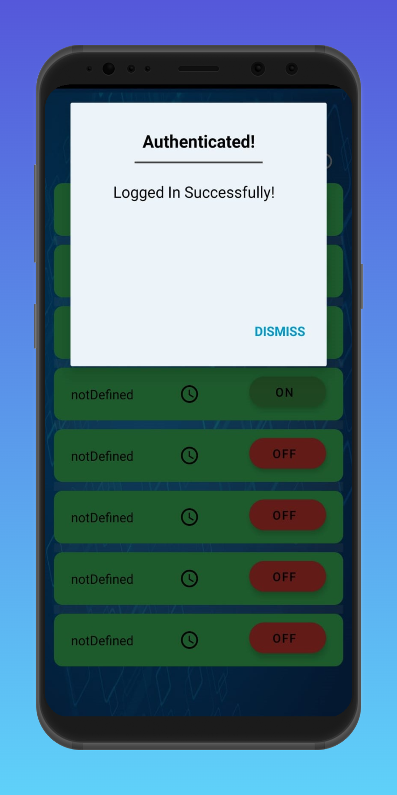

### Project Link :- https://github.com/HarshSinghRajawat/IOT-HomeAutomation-ServerCode
# IOT- SMART HOME AUTOMATION SYSTEM
This project presents the overall design of Home Automation System (HAS) with low cost and wireless system. It specifically focuses on the development of an IOT based home automation system that is able to control various components via internet or be automatically programmed to operate from ambient conditions. In this project, we design the development of a firmware for smart control which can successfully be automated minimizing human interaction to preserve the integrity within whole electrical devices in the home. We used Node MCU, a popular open source IOT platform, to execute the process of automation. Different components of the system will use different transmission mode that will be implemented to communicate the control of the devices by the user through Node MCU to the actual appliance. The main control system implements wireless technology to provide remote access from smart phone. We are using a cloud server-based communication that would add to the practicality of the project by enabling unrestricted access of the appliances to the user irrespective of the distance factor. We provided a data transmission network to create a stronger automation. The system intended to control electrical appliances and devices in house with relatively low cost design, user-friendly interface and ease of installation. The status of the appliance would be available, along with the control on an android platform. This system is designed to assist and provide support in order to 1fulfil the needs of elderly and disabled in home. Also, the smart home concept in the system improves the standard living at home.

## SMART HOME AUTOMATION SYSTEM 

https://user-images.githubusercontent.com/79416650/194739539-9375de68-2e6b-4e66-b077-a293d3c2c989.mp4
## Watch full Video : - https://youtu.be/FPMZkJAXqs8

# HOME SERVER APPLICATION
## Screenshots

### Connect with Us

<a href = "https://www.linkedin.com/in/harsh-singh-rajawat-b3ab4911b/?originalSubdomain=in">Harsh Singh Rajawat</a>

<a href = "https://www.linkedin.com/in/sahil-vishwakarma-4705801b2/">Sahil</a>

